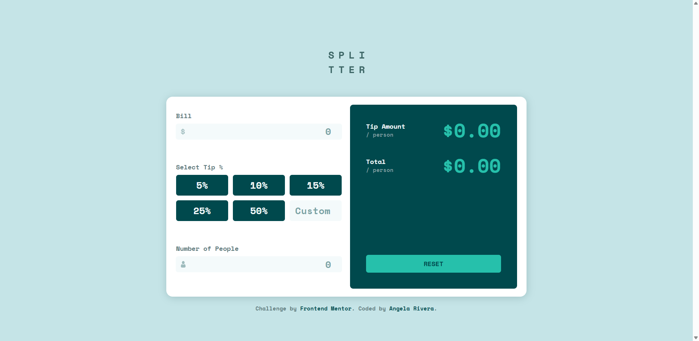

# Tip Calculator

A React app that calculates the tip amount based on the bill total, selected tip percent, and number of people the bill is being split between. Built as solution to a [FrontendMentor Challenge](https://www.frontendmentor.io/challenges/tip-calculator-app-ugJNGbJUX).

### Built with:

   

### Deployment

https://ang-riv.github.io/tip-calculator/

## Introduction

Tip Calculator is a straightforward app that displays the total amount that each person will pay based on the tip percent chosen.

## Features

- **Immediate calculation:** the moment the user inputs all the required information, the tip and total amount per person is calculated right away.
- **Custom Tip Percent:** users can enter a specific number if they want a percentage that is different from the predefined number buttons.

## Challenges

- **Problem**: Things that needed to work together were separated. Initially, the project was done in seperate components right away without taking into account what would need to work with what.
  - **Solution**: Re-did the project all in one big component before figuring out what can be separated into smaller components.
- **Problem**: Filtering notes based on date. Notes weren't showing up in order if they were created on the same day, especially if they were created very close in time to each other.
  - **Solution**: Included the full date in each note down to the second.
